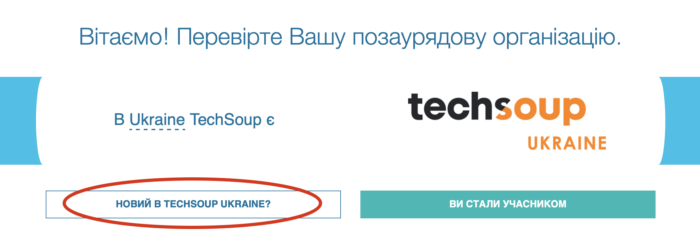
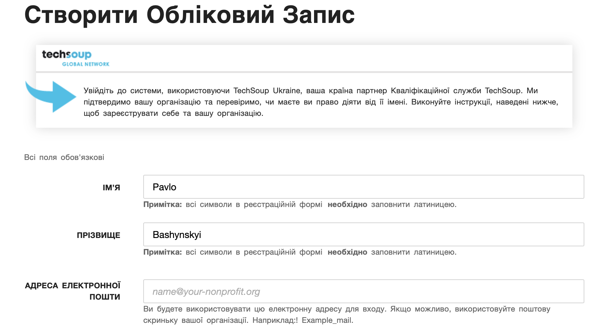
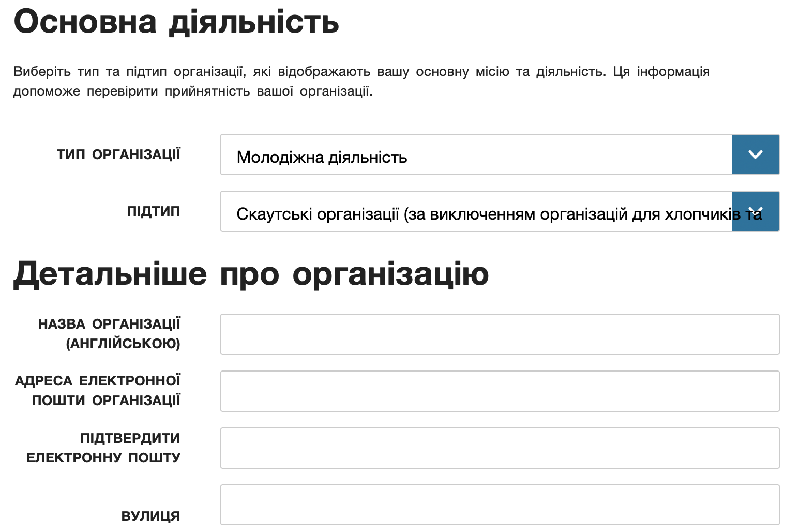
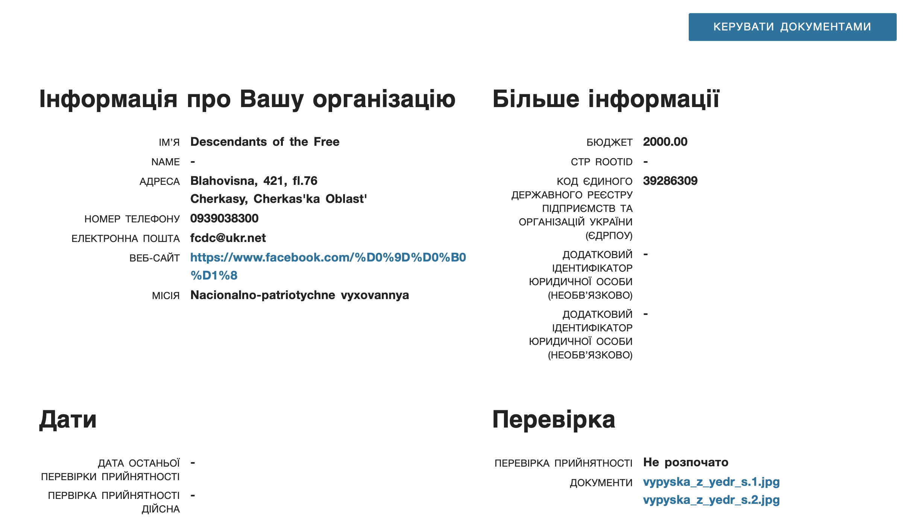
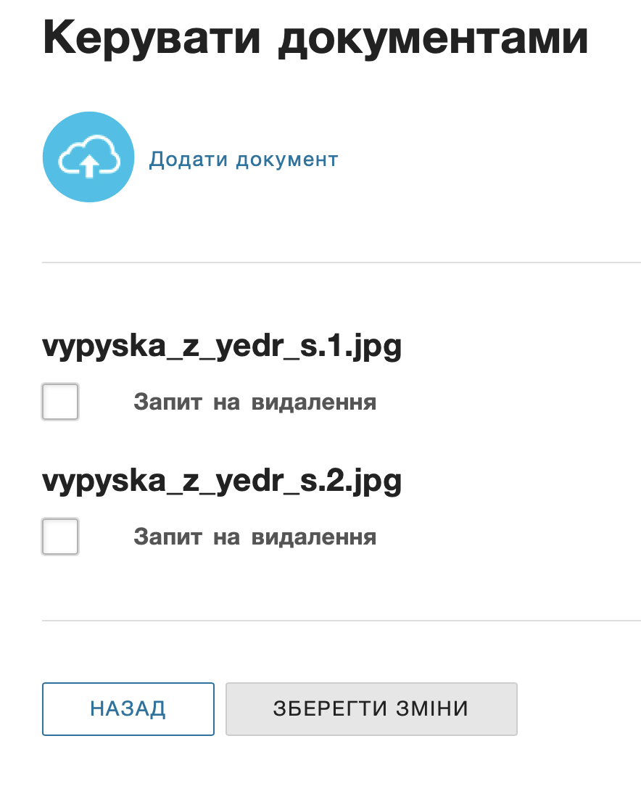

# Google for Nonprofits

Для того, щоб зареєструвати GSuit потрібно зареєструвати неприбуткову організацію на TechSoup та отримати маркер перевірки TechSoup.
Для проходження успішної перевірки організація повинна бути благодійною організацією, громадським об'єднанням чи релігійною організацією, зареєстрованою в реєстрі неприбуткових організацій і організацій з відповідними кодами неприбутковості 0005 (0036), 0006 (0032), 0013 (0035), 0011 або публічною бібліотекою.

## Реєстрація в TechSoup Ukraine

> Якщо ви маєте маркер перевірки TechSoup для неприбуткової організації пропустіть цей крок

### Реєстрація нового облікового запису

> Якщо ви вже маєте обліковий запис, переходьте в на сторінку [профілю](https://ukraine.techsoup.global/user),
> натисніть кнопку `ДОДАТИ ОРГАНІЗАЦІЮ` та переходьте до наступного пункту

Заходимо на сторінку https://app.ngok.techsoup.org/UserLogin.aspx
Та переходимо за посиланням `НОВИЙ В TECHSOUP UKRAINE?`.

Реєструємо обліковий запис.

На пошту прийде лист, з нього потрібно підтвердити реєстрацію.

### Реєстрація неприбуткової організації

Відразу після реєстрації облікового запису пропонує зареєструвати некомерційну організацію:

Реєстраційна форма заповнюється виключно латиницею.

Після відправки реєстраційної інформації виникла помилка,
щоб потрапити на сторінку створеної організації перейдіть знов на сторінку [профілю](https://ukraine.techsoup.global/user) та натисніть «Додати організацію».

На сторінці «Подробиці організації» натисніть «Керувати документами»,
додайте сканкопію Виписки з Єдиного державного реєстру юридичних осіб та натисніть «Зберегти зміни».

(Перевірити пошту та підтвердити email)

## Реєстрація домену

## Реєстрація G Suite for Nonprofits

Зайдіть на сторінку [G Suite for Nonprofits](https://www.google.com/nonprofits/offerings/g-suite/).
Прокручуйте сторінку в самий низ та переходьте за посиланням `Get started`.

<!-- https://www.google.com/nonprofits/account/u/0/signup -->
