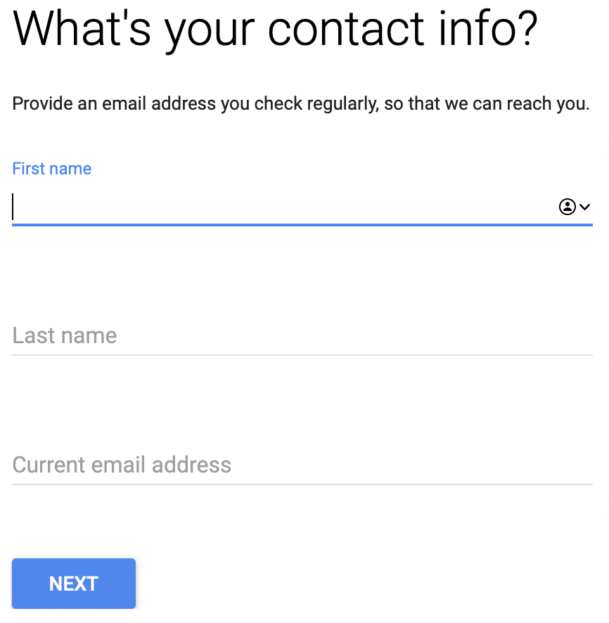

# Google for Nonprofits

## Реєстрація

Для того, щоб зареєструвати GSuit потрібно зареєструвати неприбуткову організацію на TechSoup та отримати маркер перевірки TechSoup.
Для проходження успішної перевірки організація повинна бути благодійною організацією, громадським об'єднанням чи релігійною організацією, зареєстрованою в реєстрі неприбуткових організацій і організацій з відповідними кодами неприбутковості 0005 (0036), 0006 (0032), 0013 (0035), 0011 або публічною бібліотекою.

Використання G Suite for Nonprofits в базовому тарифі безкоштовне, але для реєстрації G Suite потрібне доменне ім'я організації, за яке потрібно щороку робити внесок.
В інструкції нижче розглядається варіант оформлення доменного ім'я у Google.
Якщо ви вже маєте доменне ім'я, або хочете придбати його у іншого регістратора, то пропустіть розділ __Створення організації разом з доменом__.
Переходьте до активації домену.
Після активації Google запропонує створити організацію, де ви знов повернетесь в розділ __Створення організації разом з доменом__, але без покупки домену.

### Реєстрація в TechSoup Ukraine

> Якщо ви маєте маркер перевірки TechSoup для неприбуткової організації пропустіть цей крок

#### Реєстрація нового облікового запису

> Якщо ви вже маєте обліковий запис, переходьте в на сторінку [профілю](https://ukraine.techsoup.global/user),
> натисніть кнопку `ДОДАТИ ОРГАНІЗАЦІЮ` та переходьте до наступного пункту

Заходимо на сторінку https://app.ngok.techsoup.org/UserLogin.aspx
Та переходимо за посиланням `НОВИЙ В TECHSOUP UKRAINE?`.

Реєструємо обліковий запис.

На пошту прийде лист, з нього потрібно підтвердити реєстрацію.

#### Реєстрація неприбуткової організації

Відразу після реєстрації облікового запису пропонує зареєструвати некомерційну організацію:

Реєстраційна форма заповнюється виключно латиницею.

> Після відправки реєстраційної інформації виникла помилка,
щоб потрапити на сторінку створеної організації перейдіть знов на сторінку [профілю](https://ukraine.techsoup.global/user) та натисніть `ДОДАТИ ОРГАНІЗАЦІЮ`.

На сторінці «Подробиці організації» натисніть `КЕРУВАТИ ДОКУМЕНТАМИ`,
додайте сканкопії:
- свідоцтво про реєстрацію
- виписку з Єдиного державного реєстру юридичних осіб
- довідку про неприбутковість

та натисніть `ЗБЕРЕГТИ ЗМІНИ`.

> Для реєстрації нам вистачило додати лише виписку з Єдиного державного реєстру юридичних осіб.

Протягом двох тижнів прийде підтвердження реєстрації або зауваження по реєстраційним даним.

Перейдіть знов в [профіль](https://ukraine.techsoup.global/user), на проти організації з'явиться відмітка про активацію.

В верхньому меню перейдіть за посиланням `КЛЮЧ ДОСТУПУ`.

Скопіюйте його кнопкою `КОПІЮВАТИ`.

Це маркер TechSoup, він знадобиться для реєстрації G Suite.

### Реєстрація G Suite for Nonprofits

Зайдіть на сторінку [G Suite for Nonprofits](https://www.google.com/nonprofits/offerings/g-suite/).
Прокручуйте сторінку в самий низ та переходьте за посиланням `Get started`.

Ознайомтесь з умовами та натисніть `ДАЛІ`.

В наступній формі вставте маркер TechSoup та тисніть `ДАЛІ`.

Та знов `ДАЛІ`.

В наступній формі потрібно вказати номер телефону та сторінку організації.

Укажіть контактні дані.

Та погодьтесь з положеннями та умовами.

Натисніть `Активувати продукти`.

Та `Почати`.

Для нас це перша організація, тому визначаємо шлях створення з нуля.

Ми потрапляємо на сторінку підтвердження домену організації.

На цьому кроці потрібен домен.
Тому ми повернемось на цю сторінку після того як оберемо та придбаємо доменне ім'я для нашої організації.

Переходимо за посиланням `Створіть пробний обліковий запис` в окремій вкладці.

#### Створення організації разом з доменом

Проходимо ниску реєстраційних форм.

Натискаємо `NO, I NEED ONE`.

Обираємо вільне доменне ім'я. На жаль Google не пропонує національні домени.
Рекомендується обирати домени `.org`, вони призначені для організацій.

Заповнюємо форму з адресою

Заводимо користувача-адміна

Відмовляємось від листів з пропозиціями `NO THANKS`.

Підтверджуємо

Google нас попереджає що ми маємо придбати цей домен протягом 14 діб. Після чого на пошту прийдуть інструкції.

Далі заходимо в Google використовуючи ім'я та пароль користувача якого ми створили. В якості ім'я вводимо повністю email.

Google перекидає на сторінку білінгу, де відразу пропонує оплатити домен.
Відразу змінюємо валюту на `USD ($)`, вказуємо регістратором `Google Domains`, та погоджуємось з умовами.
Далі тиснемо `Continue`.

Знов погоджуємось з умовами та тиснемо `Continue`.

На третьому кроці Google попросить прив'язати кредитну картку до акаунту.
З неї щороку буде списуватись сума за використання домену.

Якщо списання з картки пройшло успішно то ви побачите таку картинку:

Далі тиснемо `Continue`.
І бачимо що домен придбаний та G Suite for Nonprofit не активований.

#### Закінчення реєстрації

Повертаємось на сторінку підтвердження домену, з минулого розділу.
Вводимо придбаний домен і тиснемо `Активувати`.

В розділі `G Suite для некомерційних організацій` бачимо статус заявки, та те що її розгляд буде тривати кілька днів. 

Це не все. Потрібно підтвердити ваш власний email, який ми прив'язали до G Suite.
На пошту має прийти купа листів, бажано зі всіма ознайомитись.
В листі `Action required: Please verify your email address for ...` потрібно перейти за посиланням `Verify email now`, щоб підтвердити ваш власний email.
На це дається 14 діб.

Поки розглядається заявка на G Suite for Nonprofit можна переходити до адміністрування, бо все вже працює і може приносити користь.

## Адміністрування

> TBD
