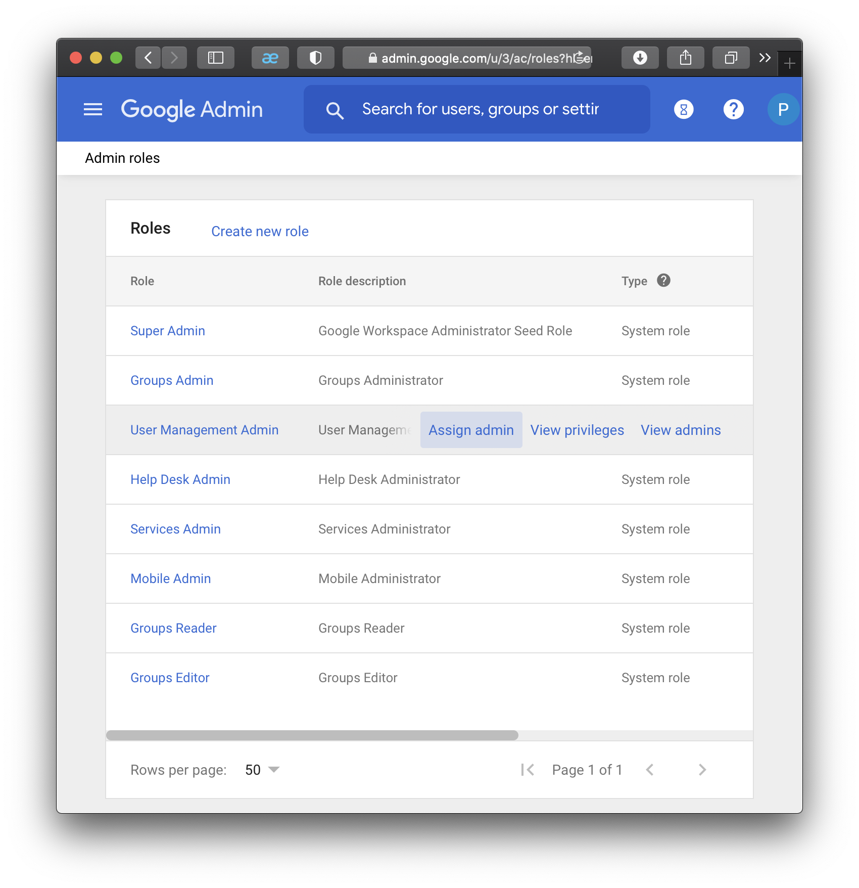

# Адміністрування

> Ця інструкція призначена для адміністратора який впроваджує цифрове діловодство в осередку.

Панель управління G Suite знаходиться за адресою [Google Admin](https://admin.google.com/).
Зайдіть на неї використовуючи обліковий запис заведений в організації.

TBD: Опис що і для чого потрібно робити.

## Створення підрозділів

Можна обійтись без цього, але за потреби роздати адміністраторські права окремим групам, краще їх розділити на окремі підрозділи.
Наприклад можна виокремити курені, станичний провід, різні адміністративні центри. Таким чином можна обмежити права, щоб адміністратори станиці не втручались в роботу куренів, а курені не заважали один одному.

Для створення підрозділів потрібно перейти за посиланням __Organizational units__ з головної сторінки адміністратора.

Там вже створена організація, натиснувши `+` з'явиться форма створення підрозділу.

За потреби можна створювати вкладені підрозділи один в інший.
Але краще не робити зайве подрібнення без усвідомлення для чого це потрібно.

## Створення облікових записів

Для того щоб надати комусь права адміністрування потрібно щоб користувач мав активований обліковий запис (дивись [Створення нового облікового запису](management.md)).

## Надання прав адміністрування

Перейдіть з головної сторінки адміністратора за посиланням __Admin roles__

TBD: про типи адміністраторів

### Адміністратор користувачів

Права адміністратора користувачів можуть бути обмежені конкретним підрозділом,
на рівні якого адміністратор може заводити нові облікові записи, або їх деактивувати.
Щоб мати право переміщувати обліковий запис між підрозділами потрібно мати права адміністратора користувачів на рівні організації.

Додаємо нового адміністратора користувачів.

Якщо навести на рядок __User Management Admin__, то на ньому з'явиться посилання `Assign admin`, перейдіть за ним.

Щоб додати нового адміністратора користувачів перейдіть за посиланням `Assign users`.

В формі почніть вводить ім'я користувача або його email, форма знайде схожих користувачів з яких оберіть потрібного.

Далі змініть підрозділ на той, в якому користувач буде адміністратором.
Для цього натисніть на посилання або олівець в колонці _Organizational unit_.

Оберіть підрозділ та натисніть `DONE`.

Далі натисніть кнопку `ASSIGN ROLE`, щоб зміни вступили в силу.

### Адміністратор груп

Адміністратор групи отримує права над адмініструванням всіх груп організації.

Додаємо нового адміністратора груп.

На сторінці __Admin roles__ наведіть на рядок __Groups Admin__, на ньому з'явиться посилання `Assign admin`, перейдіть за ним.

Щоб додати нового адміністратора груп перейдіть за посиланням `Assign users`.

В формі почніть вводить ім'я користувача або його email, форма знайде схожих користувачів з яких оберіть потрібного.

Далі натисніть кнопку `ASSIGN ROLE`, щоб зробити обраних користувачів адміністраторами груп.

### Адміністратор приміщень

Щоб мати можливість керувати приміщеннями потрібно мати права адміністратора сервісів.
Адміністратор сервісів отримує права керування всіма приміщеннями на рівні організації.

Додаємо нового адміністратора сервісів.

На сторінці __Admin roles__ наведіть на рядок __Services Admin__, на ньому з'явиться посилання `Assign admin`, перейдіть за ним.

Щоб додати нового адміністратора сервісів перейдіть за посиланням `Assign users`.

В формі почніть вводить ім'я користувача або його email, форма знайде схожих користувачів з яких оберіть потрібного.

Далі натисніть кнопку `ASSIGN ROLE`, щоб зробити обраних користувачів адміністраторами сервісів.

