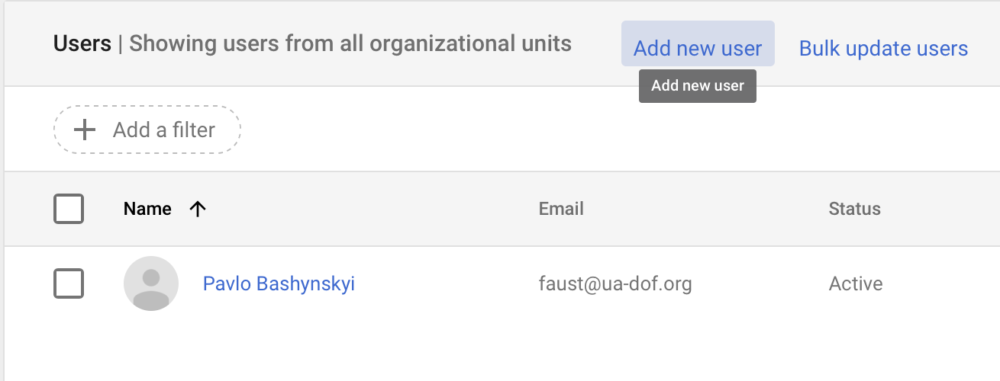
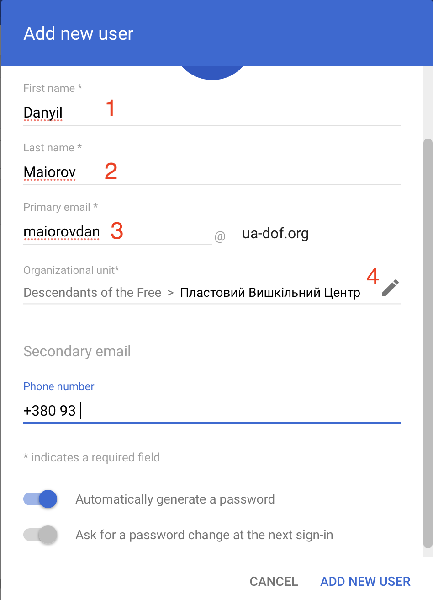
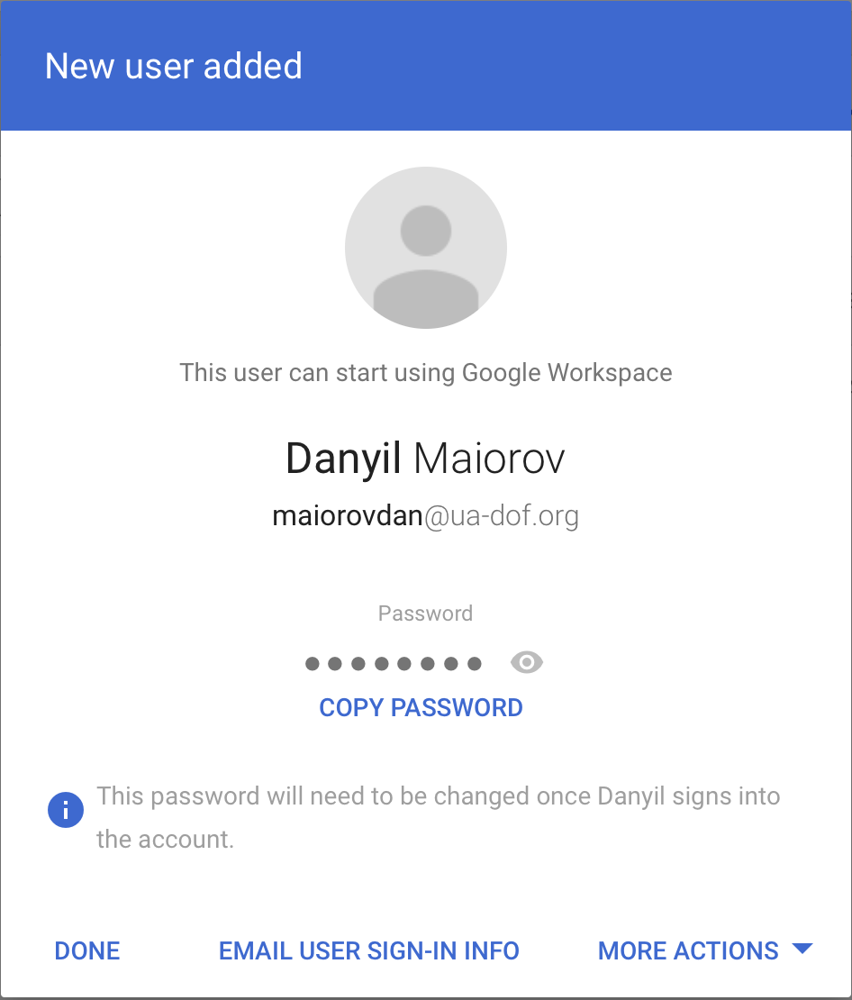
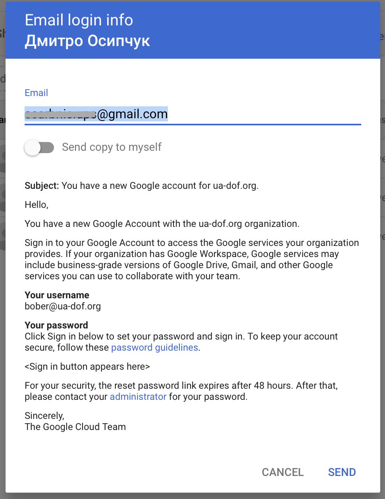
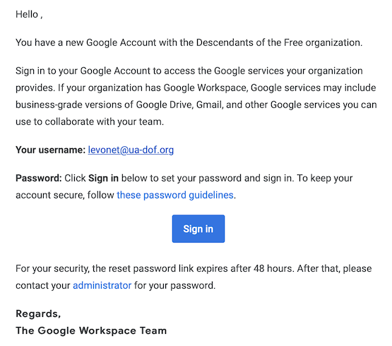
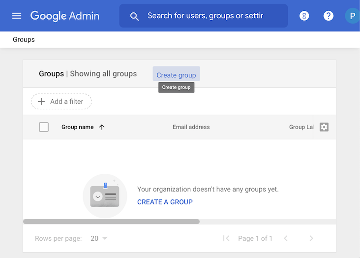
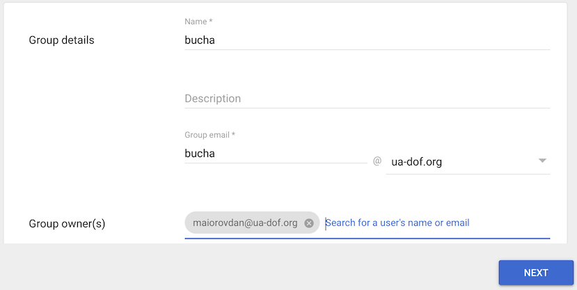
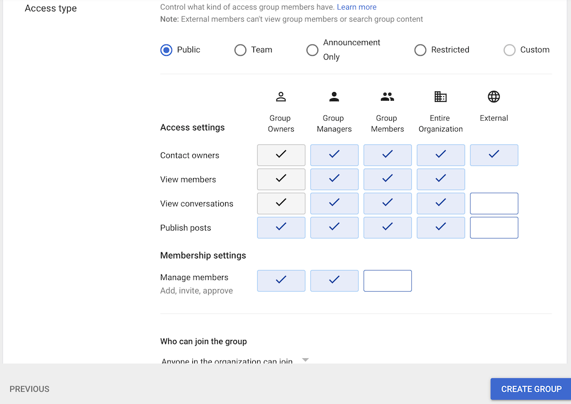
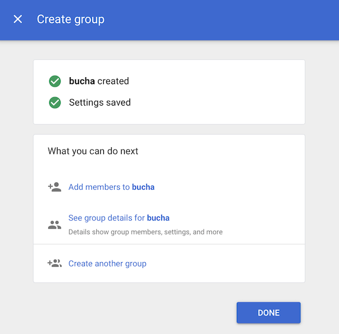

# Управління організацією

## Створення нового облікового запису

Для створення облікових записів потрібно перейти за посиланням __Users__ з головної сторінки адміністратора.

Натисніть на посилання __Add new user__

В формі нового користувача обов'язково заповніть ім'я, прізвище, оберіть логін та вкажіть вірний підрозділ за наявності.
Також можна вказати іншу додаткову інформацію.
По завершенню заповнення натискайте посилання `ADD NEW USER` в нижній частині форми.

Далі є 2 варіанти, яким чином облікова інформація потрапить до користувача:
- ви особисто її передаєте йому
- вона буде надіслана через email, якщо він був вказаний при реєстрації

Другий спосіб більш зручний, оскільки не вимагає додавання нового облікового запису в [gmail.com](https://gmail.com).

### Коли ви особисто передаєте реєстраційні дані

> Якщо ви хочете відправити реєстраційні дані на email, то пропустіть цей розділ, перейдіть до наступного.

На наступній сторінці форми:
Скопіюйте та відправте особистим повідомленням наступне:
1. email
1. пароль, для цього натисніть на `COPY PASSWORD` і він скопіюється в буфер обміну

Також відправте посилання на інструкцію користувача `TBD`.

Натисніть `DONE` для завершення.

### Реєстраційні дані відправляються по email

> Якщо ви відправили реєстраційні дані за інструкцією з попереднього розділу, то пропустіть цей розділ.

На наступній сторінці форми натисніть `EMAIL USER SIGN-IN INFO`.

Та натисніть `SEND` для відправлення листа.

### Активація

Якщо реєстраційні дані були відправлені на email, то користувачу потрібно відкрити лист та перейти за кнопкою `Sign in`.

Далі Гугл запропонує змінити пароль, на цьому активація завершується.

У випадку, якщо реєстраційні дані були передані користувачу в інший спосіб, то:
- якщо він вже зареєстрований в Google, та має пошту @gmail.com, то користувачу потрібно:
  - відкрити будь-який сервіс Google, наприклад [google.com](https://www.google.com)
  - в правому лівому куту натисніть на аватар
  - в меню оберіть `Додати інший обліковий запис`
  - в поле `Електронна адреса або номер телефону` введіть електронну адресу повністю, та натисніть `Далі`
  - в поле `Введіть пароль` введіть тимчасовий пароль, та натисніть `Далі`
  - далі запропонує змінити пароль, запам'ятайте новий пароль
  - завершіть реєстрацію слідуючи наступним інструкціям

## Керування групами

Групи потрібні для наступних речей:
- додавати групу до події, тоді всім учасникам групи прийде запрошення на подію
- отримувати на адресу групи листи які будуть бачити всі учасники (групи замість email, які прив'язуються до посади)
- вести листування в межах групи (ЗАСТАРІЛЕ) 

Для керування групами потрібно мати права адміністратора або менеджера груп.
Права адміністратора дозволяють створювати нові групи, права менеджера лише керувати існуючими групами.

### Створення групи

Для створення нової групи перейдіть за посиланням __Groups__ з головної сторінки адміністратора.

Натисніть на посилання __Create group__

В формі заповніть обов'язкові поля та додайте власника групи (поле Group owner(s)).
Власників може бути декілька.
За необхідності власників та менеджерів групи можна додати пізніше.
По завершенню заповнення натисніть `NEXT` в нижній частині форми.

Оберіть `Access type` в залежності від призначення групи:
- `Public` — краще обирати як заміну email посади, яку тимчасово виконують одна або дві людини.
  Наприклад група `skarbnyk@`, всі хто отримують цю посаду додаються в цю групу, та видаляються хто йде.
  При цьому зберігається вся історія групи.
  За необхідності цю групу можна відкрити на зовні, дозволивши писати листи на її адресу.
  В інших випадках краще не використовувати цей тип.
- `Team` — група яка буде відкрита для певної команди чи підрозділу.
  Підходить для об'єднання невеликої кількості людей в середині станиці чи куреня.
- `Announcement only` — використовуйте цей тип для об'єднання великих груп людей для оповіщення про новини або запрошення на глобальні події.
  Наприклад це можуть бути групи які об'єднують всіх з одного уладу чи однакового ступеню, або всіх хто відноситься до одного підрозділу.
  Право користування такою групою буде лише у обмеженої кількості людей: власників та менеджерів цієї групи.
  Учасники групи не бачать інших учасників групи, що забезпечує належну безпеку.
- `Restricted` — приватна група для конфіденційного листування.
- `Custom` — встановлюється, якщо параметри групи налаштовані вручну.

Налаштування `Who can join the group` дозволяє обрати як користувач може приєднатись до групи:
- `Anyone in the organization can ask` — можна зробити запити на приєднання який має підтвердити менеджер групи.
- `Anyone in the organization can join` — будь-хто з організації може самостійно приєднатись
- `Only invited users` — приєднатись можна тільки на запрошення.

Параметр `Allow members outside your organization` дозволяє приєднувати до групи зовнішні адреси.
Краще не вмикати якщо ви точно не знаєте для чого це вам.
За необхідності адміністратори груп можуть додавати зовнішні email до груп без цього налаштування.

Для створення групи натисніть `CREATE GROUP`.

Далі можна перейти до наповнення групи, налаштувань групи, створення наступної групи, або вийти на сторінку керування групами натиснувши `DONE`.

