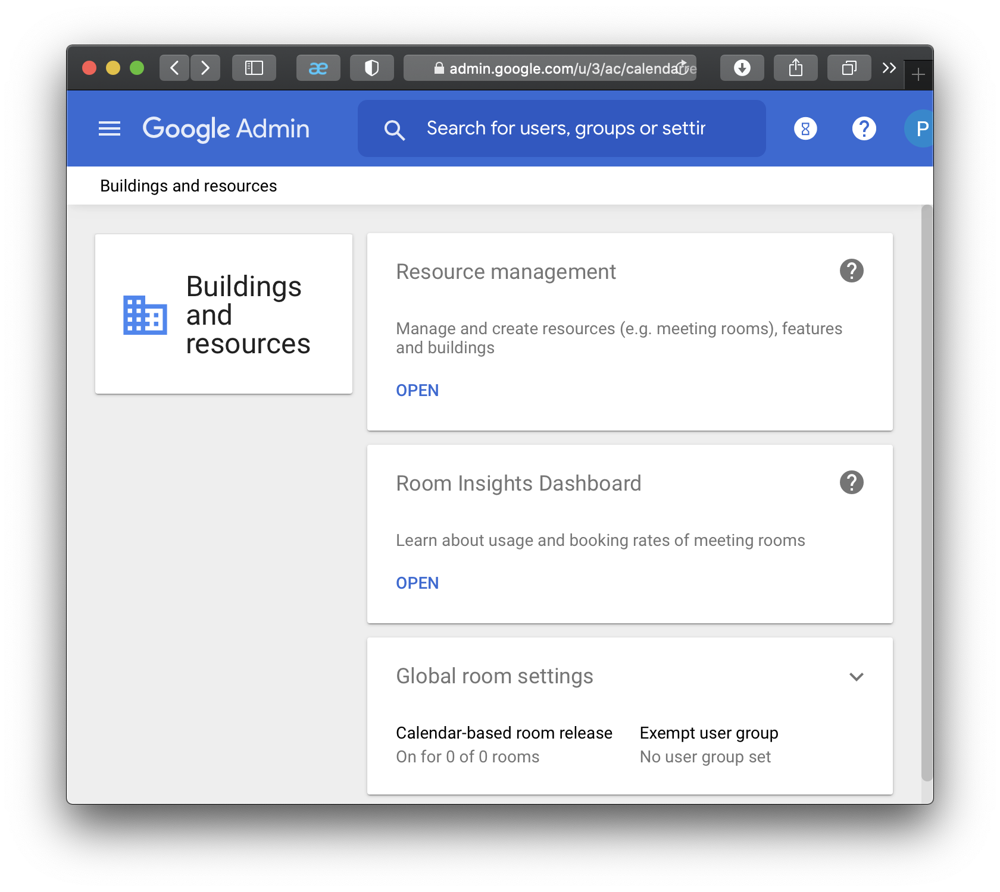
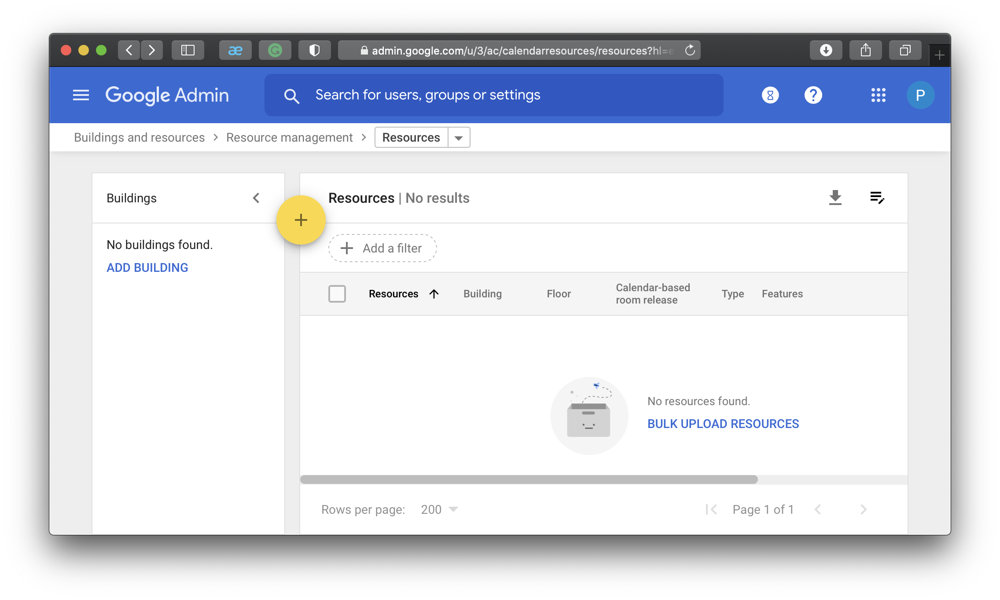
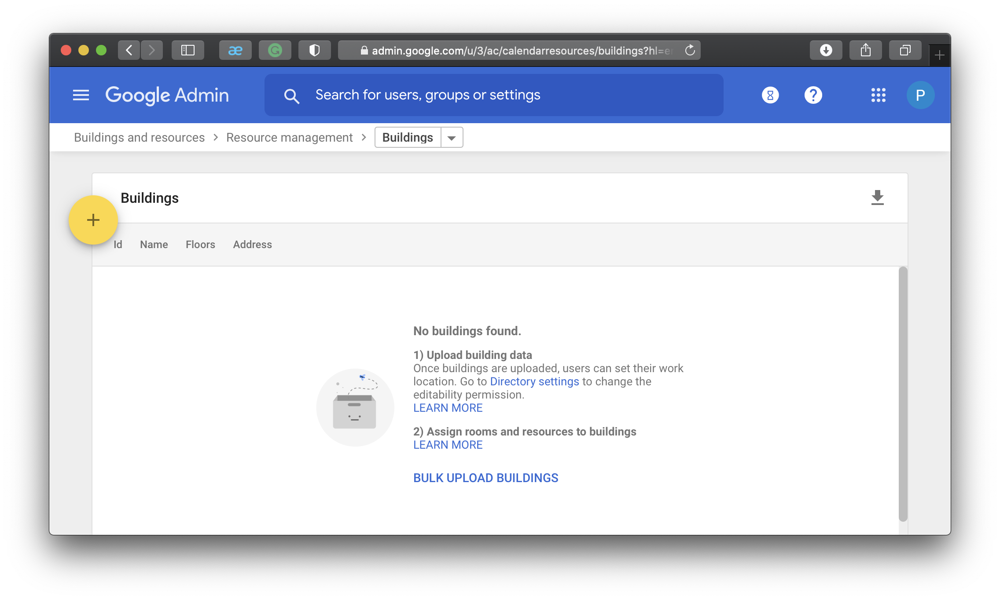
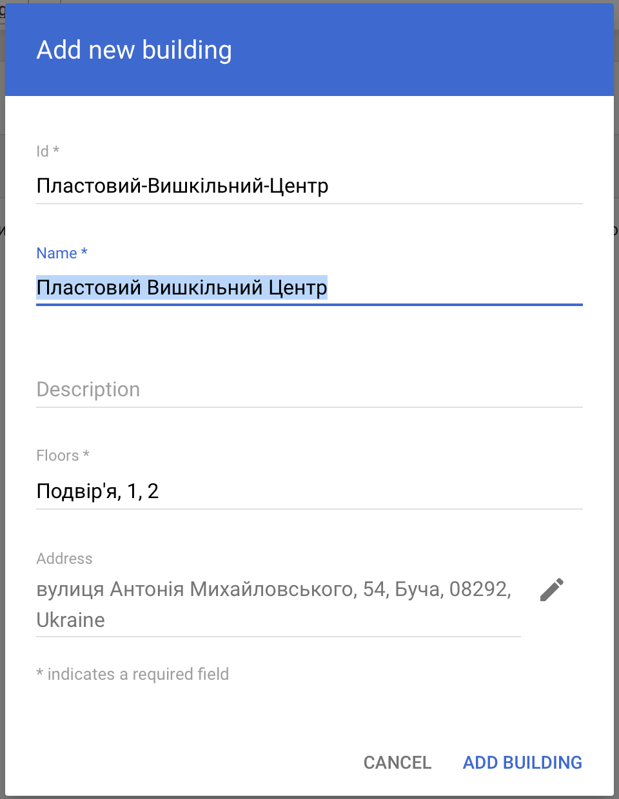
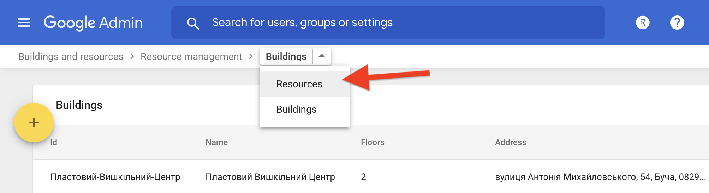
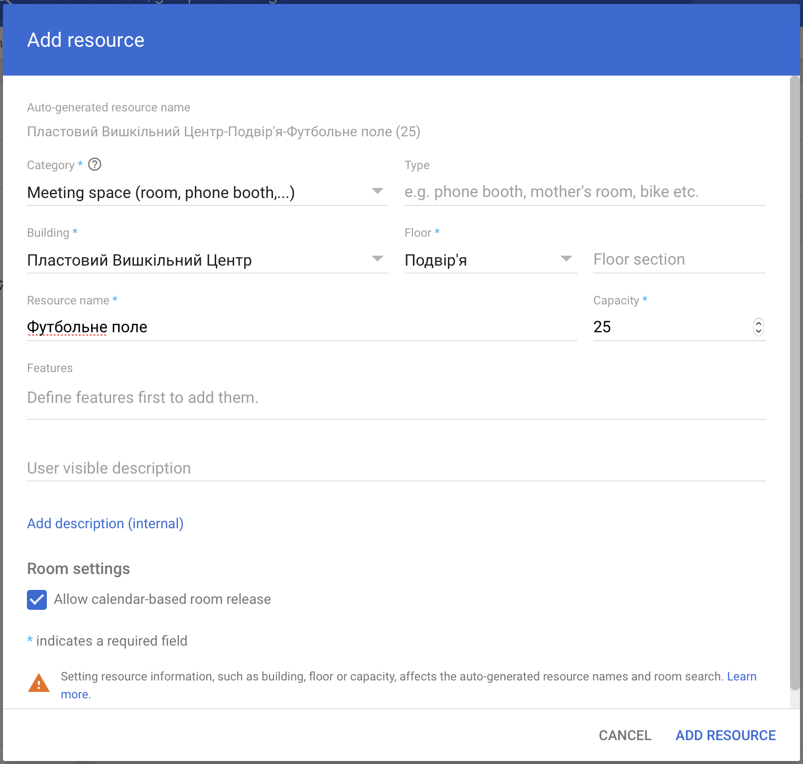
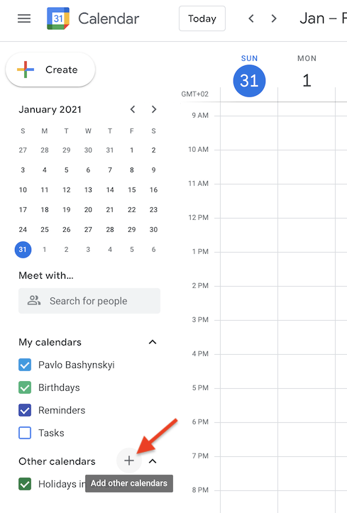
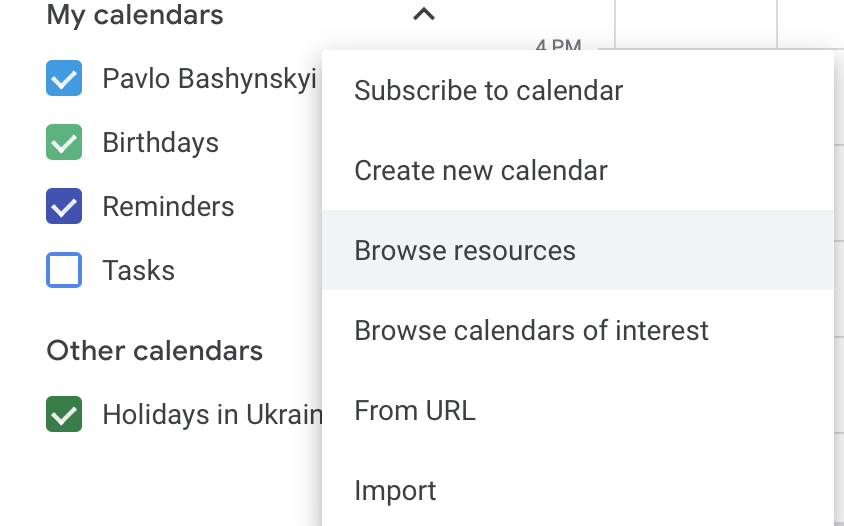
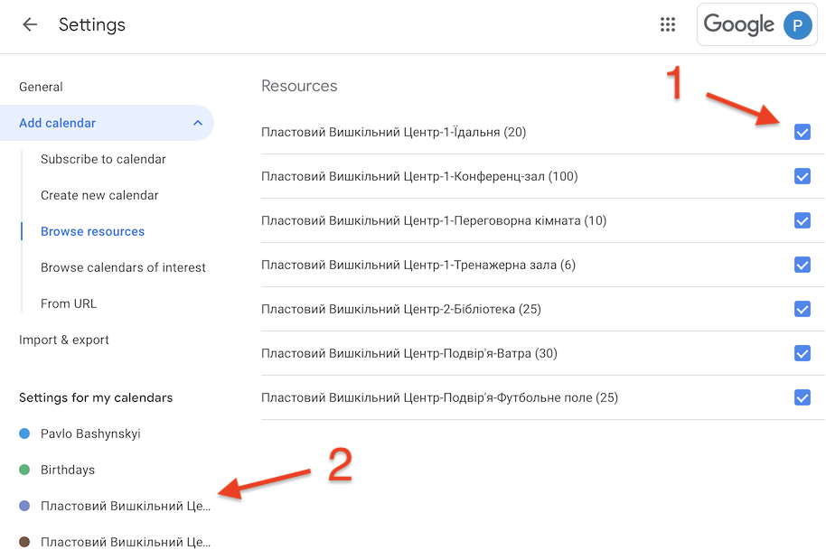
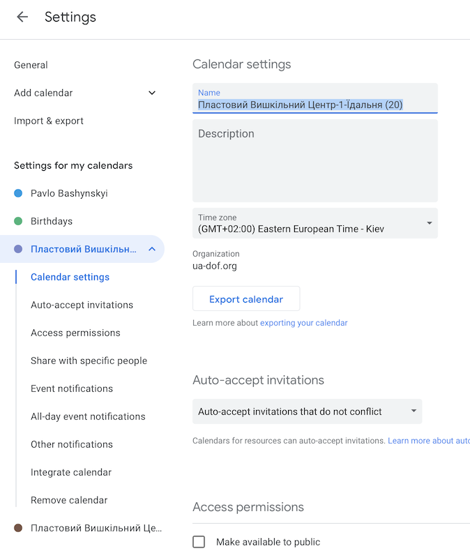

# Управління будівлею

Для керування приміщеннями потрібно перейти за посиланням __Buildings and resources__ з головної сторінки адміністратора.

На панелі __Resource management__ перейдіть за посиланням `OPEN`.

## Додавання будівлі (адреси)

На сторінці керування ресурсами перейдіть за посиланням `ADD BUILDING`, воно знаходиться з лівого боку за відсутності будівель.

Ви потрапили на сторінку управління управління будівлями.
Натисніть `+` щоб додати будівлю.

Заповніть назву та адресу (адреса має підтянутись автоматично разом з гєолокацією) та натисніть `ADD BUILDING`.
Якщо будівля має декілька поверхів або територію на якій розміщуються майданчики які потрібно резервувати в календарі,
їх потрібно перерахувати в через кому в полі `Floors`.

Поверніться назад на сторінку управління приміщеннями та ресурсами:

## Додавання приміщення

На сторінці керування ресурсами натисніть `+` щоб додати нове приміщення.

Оберіть:
- Building — будівлю
- Floor — поверх (або розташування)
- Resource name — назва приміщення або майданчика
- Capacity — кількість стільців в приміщенні (скільки людей комфортно можуть зібратись на майданчику)
- Allow calendar-based room release — автоматично звільняє приміщення якщо всі відмовились від зустрічі

Та збережіть натиснувши `ADD RESOURCE`.

## Відстеження приміщень

Ця функція потрібна адміністраторам будівлі. Відстеження вмикає відображення бронювання приміщень в календарі адміністратора.

Перейдіть в [календар](https://calendar.google.com/) використовуючи обліковий запис адміністратора.

Зліва, поруч з списком _Other Calendars_, натисніть `+`.

В списку оберіть `Browse resources`.

Відмітьте чекбокси напроти тих приміщень, за які потрібно відстежувати на календарі (1).

В лівій панелі з'являться відмічені приміщення (2).
При необхідності додаткових налаштувань, натиснувши на кожне приміщення зліва, відкривається сторінка налаштування кожного окремого приміщення.

